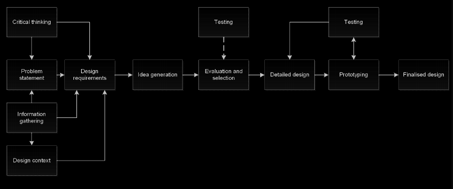

# 2024 EWB Challenge

> EWB Australia in Cambodia, Mondulkiri Province

## Overview

* The 2024 EWB Challenge is delivered through live collaboration with EWB Australia's Engineering team is Cambodia with a focus on Pu `Pu Ngaol` in `Mondulkiri` province
* `Project Briefs` were developed using EWB's Technology Development Approach, which involved
  * Community Workshops
  * Interviews with `Pu Ngaol` villagers
  * Priority issues and Aspirations of the community included themes around:
    * Water Supply
    * Agriculture
    * Education
    * Sanitation
* _Student design ideas will support EWB's Engineering team and their work on the ground in Mondulkiri province_

> The 2024 EWB Challenge is sponsored by [RS Group](https://www.rsgroup.com/)

## Program Dates

* __Registrations Due__: <2024-01-31>
* __Semester 1 Reports Due__: <2024-07-05>
* __Semester 2 Reports Due__: <2024-11-01>
* __Showcase qualifiers / Finalists announced__:
  * Semester 1 only - 3rd week of Aug
  * Semester 1 + 2 / Sem 2 only - 3rd week of November
* __Showcase Event__: (1-2 day event), typically on the 1st week of Dec 2024

## Available Program Activities

* The EWB Challenge `Design Brief` provided (Feb)
* Supporting resources (Feb)
* Introductory workshop for academies (Feb)
* Introductory presentation for students (Mar & Aug)
* Stakeholder online event (Apr & Sep)
* Student access to the EWB (ongoing)
* External review of top student reports (Jul & Nov)
* Opportunity for attendance at the EWB Challenge Series Showcase (Dec)

## Program Rules and Eligibility 

> Visit [Program Rules and Eligibility](https://mega.nz/file/aSBRHazB#YsYkSAQCF5GyWW-5SXNukvQRuNwWghHL8pn3tBwm6go)

## Submission Recommendations

> Submission [sample](https://mega.nz/file/SOZUmDjS#YpiP3dbPv17pdHpRj6MocM_cAQe9sVBekfcyJ-j-ga4)

* Respose to the specific design considerations outlined on the EWB [Challenge website](https://ewbchallenge.org)
* Evaluation of alternatives
* Details of the conceptual design, analysis and final design
* Identification of schedule and costs
* Identification of how the selected design is appropriate
* Discussion of ethics,  long term sustainability and maintenance
* Outline details of any external support provided
* Reflection

## Challenge Outlines and Contents

### Challenge Outlines

> Visit [Project Brief](./brief/area.md) 

* Executive summary
* Introduction, including the identification of information and selection of design area/project
* Preliminary design requirements
* Preliminary design solution(s)
* Reflection on team work to date
* Plan for delivery of the report at the end of semester, including `Work Breakdown Structure (WBS)` and `Grantt Chart`

### Challenge Content

  

#### 1. Problem Statement

* Problem to address:
  * Read document 2023 EWB Challenge Design Brief with Pu Ngaol village in Mondlkin province available on `canvas`
  * Select your design topics by the end of **Week 3**
* Design context and information gathering
  * Utilise the background information that EWB have gathered
  * Available on `EWB website` and `canvas`

> __DESIGN STATEMENT__
> `insert design statment here`

#### 2. Design Requirements

* Clear set of project requirements
* Functions, objectives and constrains
* Establish criteria (for evaluation and testing)
    * e.g Government regulation, physical

##### 2.1 Design Objectives

> Visit [Documentation](./requirements.md#design-objectives)

##### 2.2 Design Constraints

> Visit [Documentation](./requirements.md#design-constraints)

##### 2.3 Design Considerations

> Visit [Documentation](./requirements.md#design-considerations)

#### 3. Idea Generation

##### 3.1 Ideation

* Ideation (aka. Brainstorm)
* Functional analysis
    * Function of solutions
* Morphological charts (more details on **WEEK 4**)

> __Solution Ideation__
> `files`: [[solution]](./doc/Solutions.docx)

##### 3.2 Screening

* The `preliminary screening` is used to weed down the multiple design options into slightly fewer options by asking a simple question _Does this option meet all of the Design Constraints_  if the answer is NO, then the design option should be rejected

* `Multi-Criteria Decision Analysis (MCDA)` is suite of tools used in many parts of life to help with decision making, specifically when there is more than one criteria 
 
> `file`: [[WSM]](./doc/screening.xlsx)

