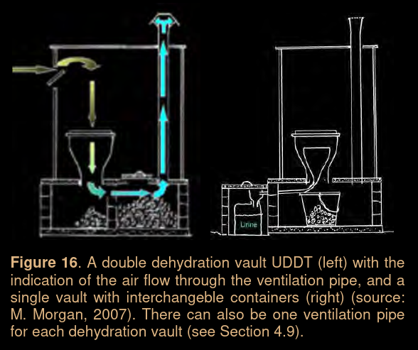

# Preliminary Design - UDDT

> Design on "Urine-Diverting Dry Toilet"

## Embodiment Design

### Function Analysis

```
Sitting toilets, often referred to as ‘Western toilet
s’, have been established as the norm in most of Euro
pe, North and South America, Russia, Australia etc. C
onversely, squatting toilets are the norm in most Asi
an and African countries.
```

> [!NOTE]
> A mix of `urine` and `faeces` causes substantial odour

1. Enable fast drying of `faeces` which makes handling of `faeces` more __simple__ and __hygienic__
2. Reduce environmental impacts
3. Allow recovery of `urine` which can be reuse fertiliser

> __The core function of a UDDT is to separate urine and faeces__

#### Toilet Seat

The most important component of `UDDT` is the `seat` which allow __separation__ of `urine` and `faeces`

#### Faeces Vault

The `UDDT` vaults serve the basic function of collecting and storing the `faeces` 

1. The `faeces` needs to be safely __stored__ in the `vaults` so that they can be hygienically separated from human contact
    * This requires a vault door or other means of __blocking__ both direct and indirect human or animal contact, while allowing intermittent access to the vault for emptying and cleaning activities
    * The vault also stores toilet paper and cover materials

2. The second important function of the vault is to __provide a dry (low moisture) conditions__ to allow the `faeces` to become and remain dry odourless
    * This is accomplished by installing the vaults above ground to avoid rain and water from entering the vault
    * Moreover this vaults should be adequately ventilated to exhaust moisture and odours

<p align="center">
  
</p>

#### Urine Collection System

> The "Urine Collection System" `UCS` is designed to drain the urine without the need for flushing water. Urine can be discharged 
> * Into an on-site infiltration system, a sewer connection
> * into a storage vessel for reuse or for off-site disposal

In summary the following three configurations for `UCs` are feasible:

1. Undiluted urine from `UDDTs` and urinals is drained directly into `soak pits` for disposal or infiltration trenches for reuse/disposal
2. Undiluted urine is collected from `UDDTs` and urinals in  containers and tanks to be stored and reused in the agriculture and transported for off-site disposal
3. Urine id mixed with other wastewater streams, such as hand washing or shower water and discharged into a [Soak pit / infiltration trench](#soak-pits-and-infiltration-trenches)

##### Soak Pits and Infiltration Trenches

> __Soak Pit__
> Also called a `soak way` or `leach pit`. Its a covered porous-walled chamber that allow water to slowly soak into the ground 


