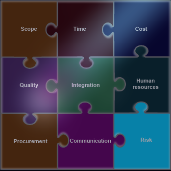

# Introduction

## Professional Engineering

## Working in Teams

### Purpose of Working in a Team

* Enssential professional skill
* Combining
  * Skills and knowledge
  * Creativity
  * Diversity
* Good for

### The Cycle of a Team

### Necassity to Work in a Team

### Roles

### Leadership

### Dealing with Conflict

### Team charter & Code of Conduct

* No set struture, but must be agreed upon
* Roles and responsibilities
* Acceptable team conduct
  * Attendance at meetings
  * Participation
* Meeting schedule
* Communication strategies
* Review processes
* Procedure to deal with lack of participation

## Engineering Projects

### Project Managment

* **Project**: "Temporary endearvour undertake to create a unique product or service" (Project Managment 2028)
* **Managment**: "The appplication od knowledge, skill, tools and techniques to project activities to meet project requirements" (Project Managment Institute 2028)

> <details>
>     
> </details>


> [!NOTE]
> * **Objectives**: What the project trying to achive
> * **Deliverabilities**: Product or services, and acncillaries, including reports

## Project Managment life cycle

```
┌──────────┐
│Initiating│
└┬─────────┘
┌▽──────┐   
│Planing│   
└┬──────┘   
┌▽────────┐ 
│Executing│ 
└┬────────┘ 
┌▽─────────┐
│Monitoring│
└┬─────────┘
┌▽──────┐   
│Closing│   
└───────┘   

```
### Project Charter

* Key personnel
  * Inc, project manager
* Objectives

### Project Scope

* Project scope : is the scope which projects cover and should be clearly defined
  * Inclusion and Exclusion
  * seek agreement with skateholers

### Project Planning

- [ ] Define activities: Work Breakdown Structures
- [ ] Identify sub-tasks
- [ ] Sequence activites
- [ ] Estimate required sources
- [ ] Estimate duration
- [ ] Develop schedule; **Grantt chart**
