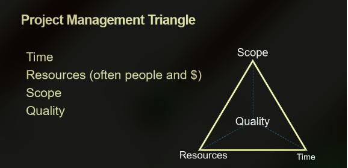

# Introduction to professional Engineering

## Topic 1 - Engineering Fundamental

### Purpose

Engineer aim to design products, systems, infrastructure and services that produce a safer, healthier and more sustianable world. Hence improve the quality of life of everyone.

#### Examples

* [Aztec Architecture](https://en.wikipedia.org/wiki/Aztec_architecture)
* [Pompei City](https://en.wikipedia.org/wiki/Pompeiij)
* [Blackfriars Bridge](https://en.wikipedia.org/wiki/Blackfriars_Bridge)

### Engineering Skills

#### Types of Work

1. Job-specific tasks (i.e. the techinal task)
2. Non-job specific tasks (e.g. an engineering performing administration)
3. Written or Oral communication
4. Demonstrating Effort
5. Maintainning personal Discipline
6. Facilliating and team performace
7. Supervision and Leadership
8. Managment and administration

#### Skills in Demand

The most important selection criteria when recruiting graduates according to Graduate Outlook Survery(2015) - Graduate carrer:
*Insert image here*

## Topic 2 - Engineering Design Process

### Definition of Design

* To design is to pull together somthing new or to arrange existing things in a new way to satisfy a recognised need of society. [[1]](https://)

* Design established and defines solutions to and pertinent structures for problems not solved before, or new solutions to problems previously solved in a different way. [[2]](https://)

### Purpose of design process

* Breaking big problems down into small and manageable chunks (i.e. Stages and Gates).
* Repeatable and flexible suits for different problems 

### The Players

* **Client** (wants the design conceived)

* **User** (employ or operate what is being designed)

* **Designer** (solves the clients problem in a way which meets the users needs)

> [!NOTE]
> Whilst not considered as one of the direct actors in the design there are others skateholders who may influence (i.e. gorverment, the general public, ..)

### Design Process

 <details>
 
 ```
 ┌─────┐    ┌────────────┐┌───────────────┐   ┌──────┐
 │Start│    │Design Brief││Design Proposal│   │Finish│
 └──┬──┘    └─────┬──────┘└───────┬───────┘   └──┬───┘
    │             │               │              │    
    │  Scooping   │               │              │    
    │────────────>│               │              │    
    │             │               │              │    
    │Organizations│               │              │    
    │────────────>│               │              │    
    │             │               │              │    
    │             │    Design     │              │    
    │             │──────────────>│              │    
    │             │               │              │    
    │             │ Design Teams  │              │    
    │             │──────────────>│              │   
    │             │               │              │    
    │             │               │Implementation│    
    │             │               │─────────────>│    
    │             │               │              │    
    │             │               │Organizations │    
    │             │               │─────────────>│    
 ┌──┴──┐    ┌─────┴──────┐┌───────┴───────┐   ┌──┴───┐
 │Start│    │Design Brief││Design Proposal│   │Finish│
 └─────┘    └────────────┘└───────────────┘   └──────┘
 ```
 </details>

## Topic 3 - Engneering Professionalism

`Engineering is a profession, and there are a set of expected behaviours and skills that come from being a part of a recognised profession. There are also perks that come from that professional recognition`

* Undestand importance of being a part of engineering community
* Presents a professional imaage, with colleagues
* Contributes to and manages engineering project activites as a member or team leader
* Conprehending critically and fairly viewpoints of others
* Appreciating body language, personal behaviout and non-verbal communication
* Self-review and performance evalutation
* Earns trust and confidence of colleagues through completion of tasks

### The Engineering Team

`In the topic on teamwork we discuss the framwork that is going to be used in this course. Additionally  we will discuss the roles that you will have to play in a team and how you might determine what role you are goint to play`



### Reflective Practice

`Reflection is an important part of enigneering pratie and professional development. Reflection on one's professional pratice generates pratice-based knowledge that is invaluable and very different from the theoretical knowledge that is embedded in technical rationality`

1. Reflective skills
2. Team skills
3. Project skills
4. Value skills
5. Design skills

* In summary the raionale for devloping reflective pratic  
  * it is a skill that is necessary for learning 
  * heavily used in engineering
  * Something employers look fo
  * Core competency element

#### Critical Reflection

`This does NOT mean that you are being negative on your actions but is the idea that to gain the most benefit and gather appropriate insights you need to performing a slightly more meaningful relection`

* Reflection becomes critical when it involves the following aspects
  1. When it is based on an analysis of `power dynamics`
  2. When the reflection is deep enough to effect `transformational change`

> [!NOTE]
> * `Power dynamics` that might exist in a system. In the engineering profession there are `power dynamics` that exis between employees and managers as well as client and designer
> * `Tranformational change` relates to the idea of thinking beyond yourself. This might be reflecting to consider how your team, or department or maybe engineering perofession more broadly may benefits
>   * Don't worry though, you might just be chinge your own pratice, but this is dont in soncsideration for the effect it might have on other actors and skateholders
* Through _critical_ reflection we can take more meaning or gain more insights after an activity that leads to change in thinking and ultimately behaviours

> [!TIP]
> Early on in your carrer in engineering it is ijust a good practice to start `reflection` and `critical reflection`
> * Help you identify `strength` and `weaknesses`
> * Capture  your `professional development`

#### When and What to Artefact

* When to use `reflective pratice`
  * At the end of a project (individually and as a team)
  * Applying for a job
  * Prepairing for an interview
  * After you fail at something
  * Before / After you graduate
  * Writing a reflection report is mandatory for gaining `Chartered Engineering` status
* Prediction and Evaluation as `reflective practice`  
