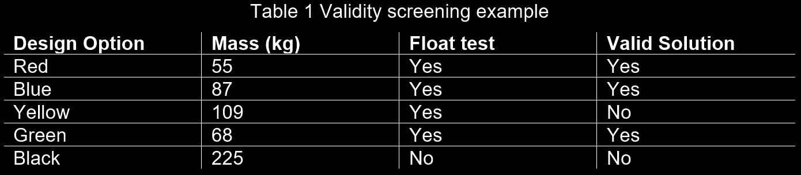
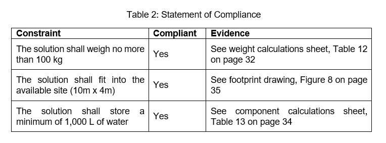

# Lab 10 - Technical Viability

## Topic 17 - Preliminary Design: Verification

> __Verification__
> Is an activity in which your design is checked to ensure it meets the stated original design requirements (_Focusing on CONSTRAINTS rather than OBJECTIVES_)

* Preliminary Design consists of cycle of three sub-stages `embodiment`, `testing`, and `verification`
* Due to the iterative nature of `Preliminary Design ` you may find yourself move through the cycles many times 
* Ultimately, the objective is to have to `verified solution`

### Why we use Verification

During the `preliminary screening` activity in the `Conceptual Design` stage we checked that the design options met the `design constraints`. But since more details are added onto concept of `prefred design` and so its important to check that your design still meets the same requirements

  

  
<b>Example</b>

  As an example, imagine that the preferred design option you have been working on with your design team is a rainwater capture system, one of the components is a tank to store the rainwater. During Preliminary Design you have determined that to take into consideration how climate change will affect future rainfall patterns you will need a greater tank volume. This means a larger tank which will add cost and may require a larger physical footprint. With the new cost calculated and footprint determined the design can be verified against the design constraints (which let’s assume included budget and maximum sizing).

The finished verification is sometimes called a statement of compliance `SOC` and is something you should include in your `Design proposal`
* The ISO definition of `verification` indicated that you need to have evidence that the design meets the `constraints` 
  * _The statement does not need to be included in the statement itself but rather an appendix then refers to its location in the statement_

### Tool - Statement of Compliance

> __Statement of Compliance__
> In its most basic form the `SOC` is a checklist 
> * It is a summary with the work focussed on the supporting evidence
> * The output of `verification` is `SOC`

> Template of [Design Proposal](https://rmit.instructure.com/courses/135772/files/36288157?wrap=1)

Steps to complete your verification:

1. Navigate to `SOC` section on page 5 of [Design Proposal](https://rmit.instructure.com/courses/135772/files/36288157?wrap=1)

2. Replace the list of constraints in the first column with your own `design constraints`

3. Verify that your design complies the constraints
    * This can be done using `components lists` or `initial drawing`
    * If compliant write _YES_ in the second column

4. Provide link to documentation that provide the evidence that the design is compliant
    * Name of this document should be included in the 3rd column

Remember your `design proposal` you will need to include the referenced evidence documents too although you should be producing these anyway

  

### A Quick Check for a Good Design

> As part of `verification` although separate to the strict `SOC` you might also want to conduct a quick check that the solution you have will meet the need of the client

## Topic 18 - Engineering Journey

> [!WARNING]
> This is a supplementary topic. Engaging with the material will enhance your understanding of the attributes, behaviours, and responsibilities expected of professional engineers, however, the contents are not explicitly assessed in the course assessments

## Topic 19 - Detailed Design

> __Detailed Design__
> is the final major stage in the `design process`. It is the link between `preliminary design` and the design getting out into the real world.

### Summary of Detailed Design

> [!NOTE]
> In this course you don't move your design through the _detailed design_ `DD` stage.
> * However in the future courses and engineering work you will nee to complete `DD`
> * One these courses is _Creative Engineering CAD_ `CE-CAD` which is coordinated by Dr. Hormoz Marzbani

### The Design Proposal

When you a design that you are progressing through detailed design you want to make sure that it is working well before launch, in engineering this launch is often called `release`
  * To enable to `EWB` to prepare for the `release` you might like to think about handling them a box.
  * You want to ensure everything `EWB` might need to implement your idea is contained in that box, contents of the box might include
    * A bull of materials listings the components prices
    * Where these can be source from
    * A plan for decommissioning the design at the end of its intended life-cycle

* The `Design Proposal` contains the key recommendation on what the client should do
* It also contains details of the design work completed and the decisions that have been made in the development of the design
* Essentially, equipped with the `Design Proposal`, `EWB` should be able to progress to detailed design

> Video resources: [link](https://rmit.instructure.com/courses/135772/pages/topic-19-detailed-design?module_item_id=5961959)

> In the video, Ramiz Gabriel talks about the importance of the Computer Aided Design in communicating the design to the client

> Video resources: [link](https://rmit.instructure.com/courses/135772/pages/topic-19-detailed-design?module_item_id=5961959)

> In the interview, RG also talks about the desire to reduce the number of RFI's or Request for Information that come from the client
