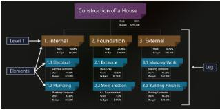
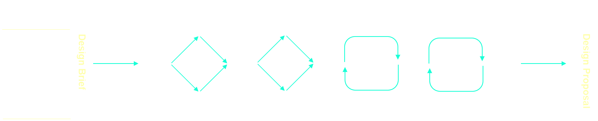

# Project Launch

## Topic 4 - Engineering Project Management

### What needs to be managed and when?

* The ability to manage multiple aspects of a project is an important ability of an engineer.
* Understand the fundamental principles of engineering project management as a basis of planning.
* There are elements of project management that are the responsibilities of all members of the design team.

#### The What

Introduction to project management that you will be able to build on in later courses. Ten ares of a project that need to be managed:

* Integration
* Scope
* Schedule
* Costs
* Quality
* Human resources
* Communication
* Risk
* Procurement
* Stakeholders

#### The When

> <details>
>     <summary><b>DIAGRAM</b></summary>
>     
> </details>

* Project management Phase:

```
┌──────────┐           
│Initiation│           
└┬─────────┘           
┌▽────────────┐        
│Planning     │        
└┬───────────┬┘        
┌▽─────────┐┌▽────────┐
│Monitoring││Execution│
└┬─────────┘└┬────────┘
┌▽───────────▽┐        
│Closing      │        
└─────────────┘        
```

### Project Planning - Scoping

* Determine the work needs to be done and what doesn't need to be done.
* `scope creep` which is where the original scope of work keeps expanding slightly but you are not equipped with sufficient additional material.

1. __Project Objectives__ `-` Overall project statement, what you are trying to achieve
2. __Project Deliverables__ `-` These are the items are artefacts that you need to deliver to stakeholders
3. __Key Milestones__ `-` What are the deadlines that the deliverables need to be submitted by. You might like to consider the milestones for submitting yout assesment
4. __Requirements__ `-` These have been spoken before in oother topics, for us you want to think about the design requiremtnts
5. __Limites and Exclusions__ `-` Defind and Declade what the boundaries of the work arem what is in scope
6. __Reviews__ How the work will be reviewd and by who and when. How will feedback be incorprated into the design

#### The Work Breakdown Structure

* `A tool used to devide a project into manageble
segments to ensure that thte complete scope of the
work is understood`
* There are a few different formats and styles of Work Breakdown Structure `WBS`, including as a hierachical list ot a hierachical diagram. There are also selivaerable based, phase based `WBS`



* If you consider your design project then you have a set of clear deliverable, the Project Proposal, the Design Review and the Reverse Client Brief


### Project Planning - Scheduling

Once the tasks and activiteis are broken down (your `WBS`). Now work out what order should they be done. To do this we use a process called scheduling and specifically a `Grant chart`


#### Document Managment

* Engineering project creates a lot of documentation
    * The Right people need access to this documentation at the right time
    * Sometimes the should be private
* Larger project may also involved multiple project teams
* Document management uses Building Information Modelling `BIM`

> [!NOTE]
> When form a design team you will need to create a Common Data Environment `CDE` which is essentially a cloud-based shared space where all design team member can access the materials.

## Topic 5 - Pre-Design

```
* Solve the Right Problem
* solve the Problem right
```



* Pre-Design Stage
    * Requirements
    * The design must meet (The Design Requirements)
    * The Problem Statement provides the description of the problem in a way that is understandable by the client and actionable by the designer

``` 
The pre-design stage is important because if the
desires are wrongly identified to the 
engineers/designer the solutions will always be wrong
```
### Pre-Design Overview


* Dicovery phase
  * Generate insights
  * Divergent thinking
    * learn as much to what the client needs
* Defining phase
  * Determine problem statement
  * Convergent Thinking
    * Narrows things down

### Dicovery Techniques

* There are many techniques that can used as part of the discovery process which can be used to generate insights into the problem space. These techniques are:
  * User Diaries / Photo Diaries
  * Interview
  * Asset Mapping
  * Observation (e.g direct obsercation or from photos)
    * Plain and simple
  * Surveys
    * Great way to gather mass information
  * [Secondary Research](#secondary-research)
  * [Literature review](#literature-review)
  * [Focus Groups / Round Tables](#focus-groups)
  * [Empathy Observation / Participatory Observation](#empathy-observation)

#### Secondary Research

> METHOD:
> Research is a type of work that allows you to gain information, knowledge and understanding of a particular topic

* In the context of engineering,
  * Design research can be done ar any stage of design process

#### Literature review

> METHODS:
> Review the work (or literature) that exists on a topic, undestand what others have already done and haven't done

> [!NOTE]
> If there is not much knoewledge then you can use other research methods to explire the topic yourself. Throughout your research you need to keep track of whose research you are using and reference it appropriately 

##### Database search Tips

* Choose your search terms (e.g `renewable energy`, `Cambodia`)
  *  `Truncation*` to cover variation of a word `energ*` to cover energy, enegergies
  * `Double quotes "` to trear two or more words a phrase 
    * e.g "renewable energy"
  * `Boolean` __AND__ to combine terms 
    * e.g "renewable end" __AND__ _Cambodia_
  * `Boolean` __OR__ to setup aternatives 
    * e.g _Cambodia_ __OR__ `South East Asia` __OR__ "Developing Contr \*"
* Peer reviews is taken seriously in academic field


##### Reputable Sources

> [!NOTE]
> RMIT uses `Scopus` database to search for literature because it is held in high regard as a repository of peer reviewed scholarly sources.

##### Citing Your Sources

* Reference usually done in two places, the `main` body of the document as well as in a `reference` section in the end of the document

> [!WARNING]
> Failure to reference the material in this manner can lead to accusations of plagiarism

* There different styles of referencing (e.g Hardvard or IEEE)

> [!TIP]
> * __RMIT Harvard style__ for the following disciplines of engineering:
> `Arespace, Automotive, Civil, Chemical, Mechatronics, Sustainable, Systems`
> * __IEEE Style__ for the foloowing disciplines of enineering:
> `Biomedical , Computer, Electrical, Electronic, Network, Telecommunications`

#### Focus Groups

* Podcast 99% invisible [The universal Page](https://99percentinvisible.org/episode/the-universal-page/)
  * An example of designers designing __for__ their user NOT __with__ their user.

#### Empathy Observation

* In the [TED talk](https://www.ted.com/talks/mileha_soneji_simple_hacks_for_life_with_parkinson_s). The designer Mileha Soneji talks about Participatory Observation and empathy to identify how to help her uncle who has Perkinson's disease.

## Gathering Insights

* Good pratice would be able to use more than one of the [dicovery techniques](#dicovery-techniques). Using one technique might only give you part of the picture
* You can generate insights by analusing the information you callate through the `discovery sub-stage` 
* Taking on multiple perspectices by using different dicovery techniques is really important
  * _Users might start to manipulate the data if they know they are influencing the insights generated_
* Ensure analysing the `discovery information` correctly and not misinterpreting
  * _e.g confirmation bias and surviorship bias_

## Design Problem Statement

* To frame `design problem statement` try to think of a single sentence that defines the problem.
  * _A trick to is to start the sentence with 'How might we'_

> [!TIP]
> A good `design problem statement` is not too broad but also not too specific

### Generate Problem Statement

* Use 'How Might We' `HMW` statement
  * Good `HMW` statements are not too _broad_ but not too _narrow_
  * `HMW` improve your life? `=>` (too bad)
  * `HMW` make your journey to university shorter by developing rocket powered roller skates? `=>` (too narrow and contains answer for question)
  * `HMW` improve your journey to university? `=>` (about right)
* Some good examples of good a problem statement

> <details>
>   <summary>James Dyson</summary>
>   Dyson don’t just look at what is currently available and try and improve slightly on that but rather go back and create a solid problem statement. You might imagine that the engineers looked at hand dryers and instead of stating, how might we make this existing hand dryer use less electricity (the existing hand dryers used hot air which was energy intensive to create) they went back to fundamentals and realised the root cause of the issue was that people want dry hands. A better problem statement of ‘how might we effectively dry hands’ removed the need to use hot air and allowed for the innovation of the Dyson Airblade.
> </details>

> <details>
>   <summary>Manu and Saad</summary>
>   Manu and Saad, two researchers from Stamford University who completely revolutionised the way malaria is detected in remote settings. The you tuber and engineer Mark Rober interviewed the pair about their approach and work. The whole video is worth a watch but if you skip specifically to 5:22 you can hear Saad talk about how they approached the problem, he essentially goes through a discovery and definition stage where he ends up with a problem statement.
> </details>

## Design Standards and Design Requirements

### Design  Requirements

`Factors that might restrict the design options in some way, these restrictions are called DESIGN REQUIREMENTS`
 * These `design requirement`s will in part be made from the `client requirement` which might be given to you in a `design brief`
* Design Requirement is an _umbrella_ term that is compromise of `design constraints`
  * `design constraints` - a limit or restriction on  the features or behaviours of the design. A proposed design is unacceptable if these limits are violated.
  * `design objective` - a feature or behaviour that we wish the design to have exhibit
* The `design constraints` must be met for a design option to be deemed acceptable

> [!NOTE]
> * A `design option` will either meet ot not meet a `design constraint`
> * A `design objective` can be _fully met_, _partially met_, or _not met_ at all.

> [!TIP]
> Defining and stating the `design requirements` comes after the `discovery activity` because you often need to use the insights that you generated from the `discovery activities` to form the requirements


#### Identify Design Requirements

* `Design requirement` are likely to be identified during the `dicovery activity` as this is when you gathering insights into the context.

> <details>
>     <summary>Example</summary>
>     For example if you have worked on water supply projects in Australia previously you are likely to know (or at least know where to look) the relevant legislation that your design will have to comply with. You might also see that you need your solution to integrate with other designs that the client might be using.
> </details>

> <details>
>     <summary>Exmaple</summary>
>     example if you are designing a water filter then the component which receives the water from the source needs to be correctly sized so that it can accept the incoming pipe. Your client may also have existing logistics networks that they use.
> </details>

#### Writing Design Requirements

* __Focused__ - `design requirement` should state `what` the design achive but NOT `how` the design should achive the requirements
* __Clear__ - `design requirement` should be clear, a rule of thumb is that an engineer coming into the project should be able to read the `requirement` and not have any questions
* __Measurable__ - When completing screening activities later in the process, each design option will bescored against the `design objective`. This means that the _requirements_ need to be measurable
* __Testable__ - In a later phase of the `design process` you might evaluate the final design against the `design requirement`. Knowing there is a way to test the design against the requirements can help in this instance

