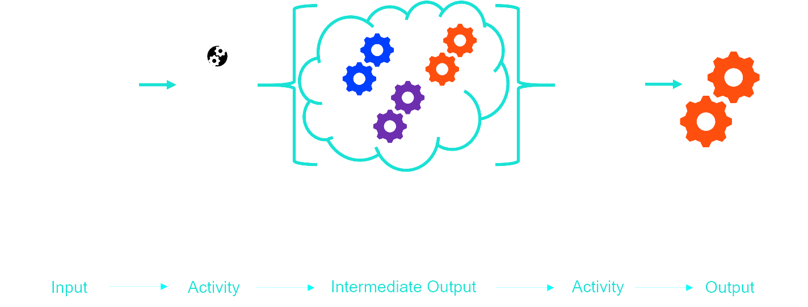
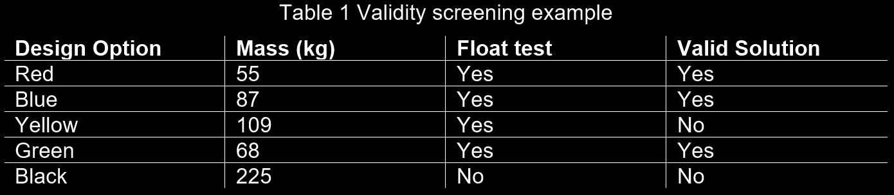
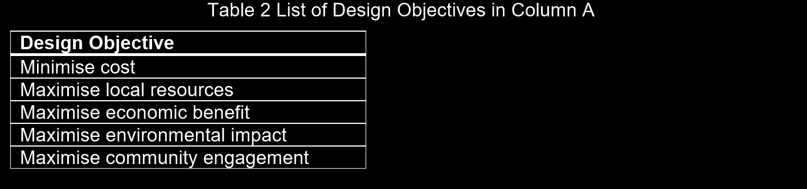
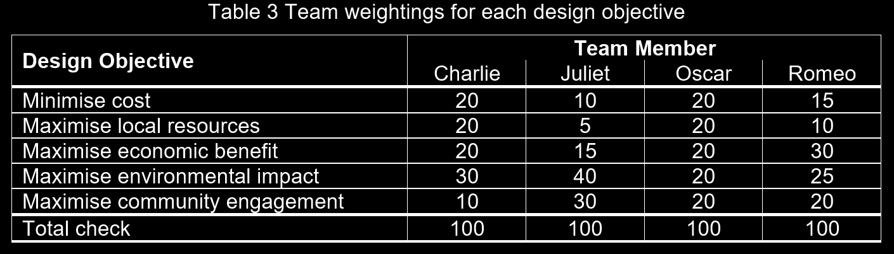
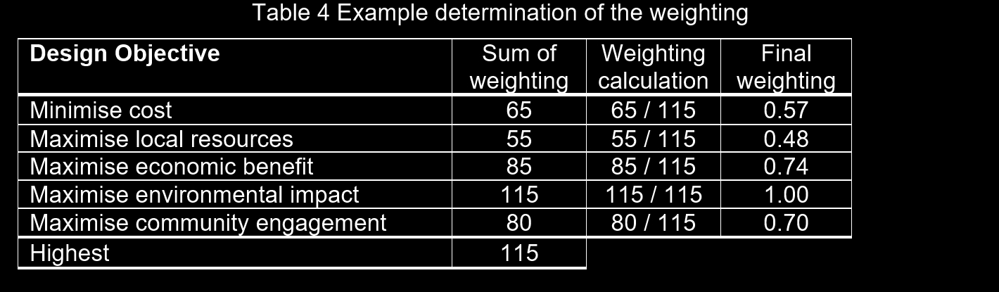
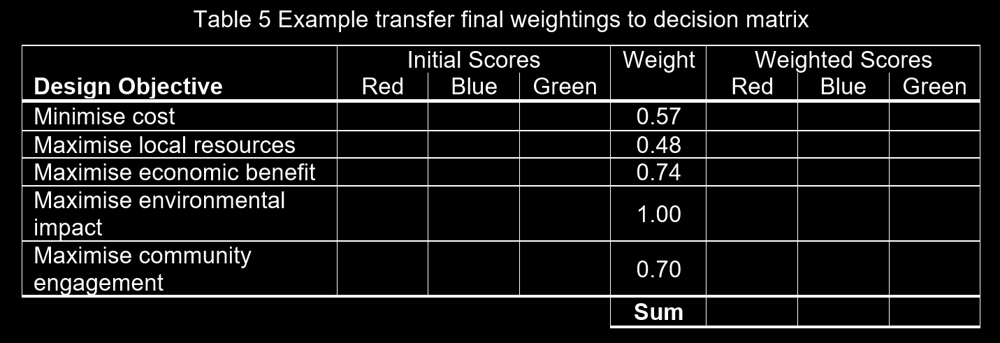
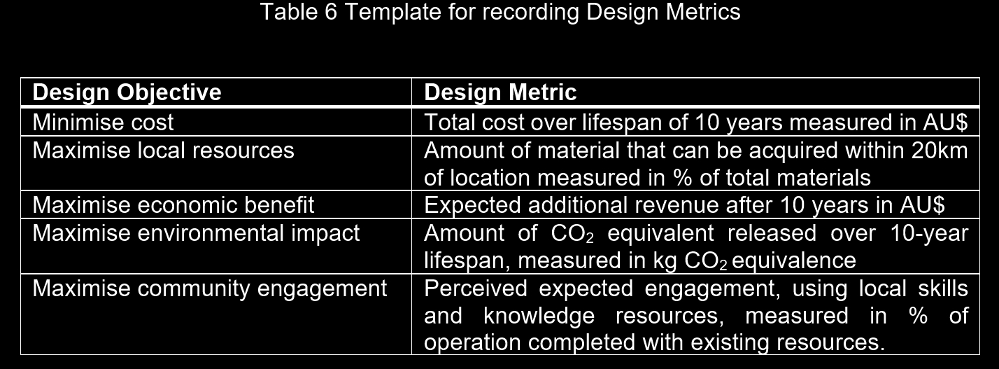
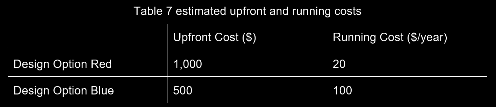
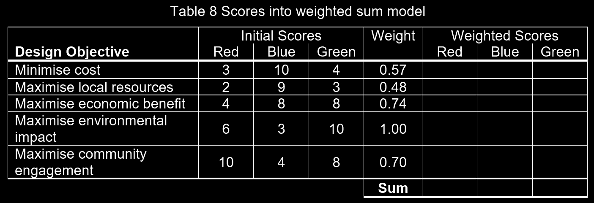
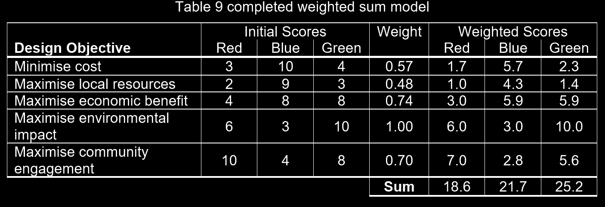

# Topic 9 -  Conceptual Design: Screening

The `conceptual` design stage progress the project by moving from a defined problem to preferred solution. `Screening`, where the best or preferred design solution is identified from the multiple unique design options

* To actually screen the multiple design options and identify the preferred solutions.
  * Each design possesses `strengths` and `weaknesses` `=>` check them against each other
  * And whats important to the design i.e Design Requirements

> [!NOTE]
> Good engineers make justified decisions based on the best available facts, information and using established processes and tools

* In this course you are getting used to two tools 
  * `preliminary screen` -  based on the design `constraints` you have developed
  * `Weighted sum model` - based on the design `objectives` you developed

## Preliminary Screening

> The `preliminary screening` is used to weed down the multiple design options into slightly fewer options by asking a simple question _Does this option meet all of the Design Constraints_  if the answer is NO, then the design option should be rejected

* Remember the `design constraints` are the `design requirements` that must be fulfilled
  * Asking this question determines whether a design option is in fact a valid option or not

### Validity Screening Example 

1. Let say you have a ideation tools to generate five design options simultaneously `Red`, `Yellow`, `Blue`, `Green`, and `Black`. Now you want to screen out the preferred design option. The validity screen checks that the solution is valid by checking the solution against the constraints
2. The `Constraints` are:
    1. The solution _shall_ NOT exceed 100kg in mass
    2. The solution _shall_ NOT float on water

* Even in relatively low `LOD` in each design option it is possible to make some _preliminary_ calculations as to the mass and the buoyancy of each design option

* We can see that the `Yellow` design option is NOT valid - As it exceeds in mass constraint
* And `Black`is not valid  - As it exceeds both constraints

`=>` We now have three valid design options

## Weighted Sum Model

> __Multi-Criteria Decision Analysis (MCDA)__:  
> is suite of tools used in many parts of life to help with decision making, specifically when there is more than one criteria 

* MCDA should be considered as a heuristic tool - it can help you make good decision but it is not necessarily the best or optimal decision

### Creating the Weighted Sum Model

> Whilst there are many forms of MCDA one of the simplest and recommended tool is the `weighted sum model` or `WSM`

#### Example

Let's return to our example. The three remaining design options are `Red`, `Blue`, `Green`. We will now use `WSM` to determine the preferred design option

* There are many ways to approach developing weighting. The __Expert judgement__ methods is outlined below

1. Collate design objectives

> IN THIS EXAMPLE WE WILL HAVE 5 DESIGNS
> 
> 

2. ADD WEIGHTING

> In this approach each group member independently allocates a split of 100 points between the design objectives
> 
> 

3. SUM THE WEIGHTINGS FOR EACH OBJECTIVE

> The team than adds up the points allocated to each `design objective`. The highest point allocation becomes the `denominator`, and the weightings for each `design objective` are determined by dividing the total points allocated by this `denominator`
>
> 

4. ADD FINAL WEIGHTINGS TO SCORING CHART

> You now have the weighting for each `design objective`. For our example you can see how the weightings have been transferred
> 
> 

### Using the Weighted Sum Model

Now that you have your weightings for each `design objective` you need to identify and document the method that will be used to _qualify_ the score for each `design option` against each `design objective`. Essentially this fills out the initial section of [[4]](#final)

> [!NOTE]
> A `design metric` is the scale applied to a `design objective`

5. QUANTIFY THE METRIC FOR EACH DESIGN OBJECTIVE

> Most `design metric` can be developed for objective or an equivalence and you should record this `metric`
>
> 

6. SCORE EACH DESIGN OPTION

* To start adding into [[4]](#final), you need to provide initial scores for you designs against these `metrics`.

> [!TIP]
> At this stage of the process, its OK for this score to be you best estimate. A good approach is to consider the main components and think about their properties

> To score each `deisgn option` you might have to perform some additional calculation
>
> 

* In the example above the upfront costs of `Red` are twice as high then `Blue`, however if we consider the 10-year expected life-span the design then costs 
  1. `Red`  = 1,000 + (20x10)  = 1,200
  2. `Blue` = 500   + (100x10) = 1,500

`=>` Blue is now more expensive and also would receive a lower score 

7. SCORING
> 
    1. Score each design option

> You can now use your `metrics` to score each `design option` against each `design objective`. You put these in your `WSM` model
> 
> 

    2. Multiply by the weightings

> Now that you have the `inital scores` you can multiply each by the weighting to get the weighted scores
>
> 

    3. Identify you preferred `design option`

Using the totals in the  last row of [[7.2]](#multiple) you would now be justified in recommending that you take forward `Green` as it has clearly scored the highest on the weighted `decision matrix`

> [!IMPORTANT]
> What interesting is that if summed the initial scores, the `Green` only scores 33 and `Blue` scores 34. The importance of weighting of the `design objective` was crucial
  
## Tips and Tricks

> [!TIP]
> An important mindset when using the `WSM` is to stay impartial and remove and bias you might have. 
> * If your own _personal_ preferred `design option` get rejected you must let it go and trust the process
>
> Remember to keep the rankings of objectives consistent 
> * i.e The highest is always the best

