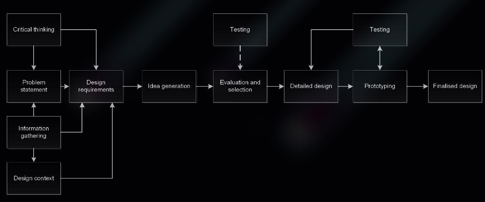
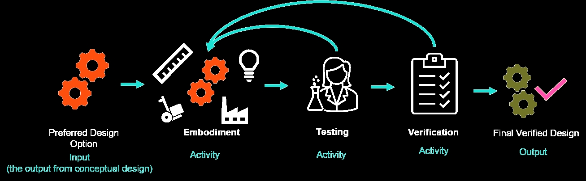

# Lab 8 - Presenting and Ethics

## Topic 10 - Engineering Communication

Throughout the design project you will gave to communicate your ideas to your tutors, clients through the external deliverables e.g. the `design proposal`
* The form of communication might change depending on who you are communicating with
* There are some methods of communication which requires additional skill set
  * Assessment Task 3: Design Project Presentation
  * Assessment Task 4: Final Design Proposal

### Types of Engineering Communication

In the engineering industry you will often be asked to present your work to your co-workers, boss or client.No matter the context you need to be able to put together and present your work, enduring that you make the presentation available and relevant yo your audience 

#### Good Communication Tools

Whilst having examples of good communication is valuable as a benchmark, having tool is much more practical

#### Communication as Design Tool

> The 10,000 year problem

[Ten Thousand Years](https://99percentinvisible.org/episode/ten-thousand-years/) - __99% Invisible__

#### The Digital Communications Age

Whilst information can be spread at the speed of light so can misinformation 
> In June 2021, [reports](https://www.abc.net.au/radio-australia/programs/pacificbeat/vaccine-expert-good-info-needed-tackle-covid19-conspiracies/13376324) first emerged that a number of hoaxes are circulating on `Whatsapp` and `Tik Tok` in Fiji relating to the available COVID vaccines. After a community leader was vaccinated other community members were coming up with metal spoons to see if they were now magnetic

### Inclusive and Accessible Communication

When you communicate, weather it be verbal or non-verbal, formal or informal, you want to ensure you are being __inclusive__ and __accessible__.
* Any time you communicate you should intentionally consider if  you are being __inclusive___ 

Great resources explaining the importance of __inclusive__ and __accessible__ communication

[Inclusive Language Guide](https://www.rmit.edu.au/content/dam/rmit/au/en/students/documents/services-support/lgbtiq/guide-inclusive-language.pdf) - __RMIT University__
[5 Ways to be More Accessible](https://www.rmit.edu.au/students/news/2021/five-ways-to-be-accessible) - __RMIT University__

### Engineering Report Writing

In engineering you can't get away from report writing. It is the medium through which information about a particular project id captured, stored and transferred
* Whilst there are specific standards expected of engineering reports the general guidance on report writing is very relevant resources 
  * [Report Writing](https://emedia.rmit.edu.au/learninglab/node/529) - __RMIT University__
  * [Writing Reports](https://emedia.rmit.edu.au/learninglab/content/reports-0) - __RMIT Learning Lab__ 

Concepts in Engineering [^1] suggests that engineering technical writing should be

* __Accurate__ - it is essential that the information be correct
* __Brief__ - Your `reader` is busy, don't use 100 words when 20 would do
* __Clear__ - Ensure your wording can only be interpreted in one way
* __Easy to Understand__ - your job is to express, not impress

### Presentation

> [Video resource](https://rmit.instructure.com/courses/135772/pages/topic-10-engineering-communication?module_item_id=5961932) [^2]

## Topic 11 - Engineering a Presentation

> Being able to present a position, idea, story, or something else in a compelling way s an important life skill

Why Engineers use presentation
* Presenting findings, a recommendation or any other form of information is part of the day-to-day life of an engineer
* A `presentation` is different to other forms of communication in that it is mostly one way knowledge transfer
* A `presentation` can be also more dynamic than a report
  * The `presenter` can read the expressions of the faces of the audience and decide about sections of the presentation to go into more detail or to skip over

`=>` Because its an established method of communicating information to a group of interested people, who then may make decisions about the future of the project you are working on

### How to Present

Before deciding what if going to be presented its important to work on how it should be presented. 

> [!NOTE]
> For Assessment 4: Project Presentation there are some administrative requirements such as the fact that every `member` of the design team needs to be involved.
> * Whist this might seem like a tough task, it doesn't mean everyone has to present core material
> * Most guidance on how to deliver a good presentation is focussed on an individual presenting
> * [Nick - how to present](https://rmit.instructure.com/courses/135772/pages/topic-11-engineering-a-presentation?module_item_id=5961933)[^3]

As a quick reminder the roles are:
* __Presentation Manager__ - this person might welcome the audience
  * introduce the topic and the rest of their design team and provide an overview of the content
  * At the end of the main body of the presentation they might then ask if anyone has any questions and then manage the questions, directing them to the relevant design team member to answer
  * The presentation manager is also responsible for ensuring the presentation is running on time

* __Presenter__ This role sees the person talk to the main points of the presentation, this might be 3-4 minutes each on a particular section like `idea generation` or `preffered option selection`

* __Question Responders__ This role can be the hardest to prepare for as you never know what the questions are going to be. Each question responder might have one or more themes that they are going to cover so the presentation manager knows who to direct the question to

> [!TIP]
> The use of `team roles` can ensure that presentation runs smoothly and is not cluttered with people talking on top each other. there are some more tips in this [video material](https://rmit.instructure.com/courses/135772/pages/topic-11-engineering-a-presentation?module_item_id=5961933)
> > RMIT Library Resources
> > The library has some good resources to help you prepare for your presentations in general, visit [link](https://emedia.rmit.edu.au/learninglab/content/oral-presentations-part-1-4)

### What to Present

A few of the important tips that get overlooked and explain how to put these into action

1. __Using Images__
  * to avoid copyright infringement try to use your own images whenever possible
  * You can use images from the web but ensure they are able to be used
    * `e.g`. On Google images, go to tools, images rights, and select "labelled for non-commercial reuse"
  * You may also be able to use the image library through the Adobe Creative Cloud 
  * When using an image you need to still include a caption / citation to indicate who owns the copyright to the image

2. __Using Videos__
  * Don't link to `youtube` if its likely adverts will play
  * Make sure any embedded video has the files in the correct directory

  * > Assessment Task 4: Project presentation
    > You will be using your own computer, so ensure that any video or linked materials work before connecting to main screen

3. Navigating PowerPoint
  * You don't have to use PowerPoint for your presentation but most groups will. There are `shortcuts` to help you navigate

### How To Watch a Presentation

> This is mostly focussed on being a good team player and not being disrespectful to the people who are presenting their work

* Arrive on time and pay attention to what is being said
* Ask questions that allow the presenting team to showcase their knowledge _(NOT for you to showcase your knowledge)_
* Ask open questions that allow the presenters to expand on their work, not closed questions

## Topic 12 - Ethical Practice

> Demonstrating [ethical practice](https://www.engineersaustralia.org.au/sites/default/files/resource-files/2020-02/828145%20Code%20of%20Ethics%202020%20D.pdf) is an important part of gaining status as graduate engineer as well as Chartered Professional Engineer

In order to prepare for the profession you need to be aware of how to analyse a situation for ethical considerations and then act accordingly. 
* `(-)` Behaving in unethical manner poses a huge reputation al risk to yourself, your company and the whole profession - [Actions of an engineer are being put under the microscope](https://www.abc.net.au/news/2021-09-02/engineer-investigated-over-skyview-castle-hill-structural-issues/100425626)

### Introduction

> Video resource: [here](https://rmit.instructure.com/courses/135772/pages/topic-12-ethical-practice?module_item_id=5961934)

### Ethical Behaviour

> Video resource: [here](https://rmit.instructure.com/courses/135772/pages/topic-12-ethical-practice?module_item_id=5961934)

### Whistle Blowing

> Video resource: [here](https://rmit.instructure.com/courses/135772/pages/topic-12-ethical-practice?module_item_id=5961934)

### Liability

> Video resource: [here](https://rmit.instructure.com/courses/135772/pages/topic-12-ethical-practice?module_item_id=5961934)

## Topic 13 - Preliminary Design - Embodiment

> Design Process Roadmap
> 

Design option is still just a concept, you might have an idea of what the `final-design` might look like but you will only have a sketch with some of the functions identified without any significant evaluation (verifications) which needs to go to `Design Proposal`
* `Design-propsal` is the document submitted to the client at the end of the design process and there should be enough detail for the client to make an informed decision
* Moving from `preferred design option` to a `verified final design` is where `preliminary design` comes in

> The Preliminary Design stage
> is all about taking the skeleton of the preferred design option and starting to flesh it out and build on that initial idea

* It is a stage where you make decisions relating to the likely form of the design and other critical elements such as the `material` to be used or `strength` requirements. 
* `Embodiment` is the term given to this activity of adding in details and stating design calculations
> [!NOTE]
> Because of the iteration between elements or functions of your design you will probably find that `preliminary design` is not a straight-forwards linear process but rather becomes iterative

* The _iterative_ nature of `preliminary design` kicks in as you add details to one component you might ind you have to make a slight adjustment to another component 

  

1. Once you have completed a round of `embodiment` you need to test that your solution actually work. There are many forms of testing that you can perform
    * Physical testing `(optional)` - build a prototype
    * User testing - review how a user engages with your product
`=>` Adjust the design based on the testing results

2. Moving onto `verification`. This is basically a fancy engineering term for checking
    * Double check and meets each of the design constraints (make recommendation if does NOT)
    * If solution if not verified and you have to make adjustments, then you might have to repeat the whole `preliminary design` cycle

3. `preliminary design` can be broken down into `embodiment`, `testing`, and `verification`

### Functional Analysis and The Morphological Chart

#### Function Analysis

We can use process of `functional analysis` to work out the functions that our solution needs to perform and then developing multiple ways to meet those functions

#### Morphological Chart

> A great tool for this task is the `morphological chart` [^4]
> * [IPEP - Morphological Chart Template](https://rmit.instructure.com/courses/135772/files/36288204?wrap=1)
> * [Morphological Chart](https://rmit.instructure.com/courses/135772/files/36288207?wrap=1)

### Embodiment Design

In the `embodiment activity` that moves the design from just a concept to a more real design where you start to develop the design for each of the `components`
* The `components` are the solutions to each of the sub-functions that you determined in the `conceptual design` 

> [!IMPORTANT]
> In `Embodiment design` you might want to start adding the detail using some basic inputs for likely supply (`inflow`) and demand (`outflow`)

> [!TIP]
> When working on `embodiment design` it makes sense to divide the work out amongst the team. This means you might want one or two members working on the embodiment of each component

> General guidance if that wen designing each component consider:
> * Approximate sizing
> * Which material the component is made from
> * How it is produced / procured (either purchased as an existing product or manufactured as a custom component)
> * How it interfaces (interacts or connect) with other components
>   * You might want to go into another level of components
>   * Breaking up `main components` into `sub-components`. This is something to be left for the `detailed design`
> * How the component will be assembled on site

Once all the components have been considered you should also draw or consider the solution as a whole with the approximate location and relationship between the components described. Regarding LOD, there are different school of thoughts
* Some advocates for adding as much detail at this stage as possible
* Other would say that you don't want to add too much detail if your prototyping and testing forces you to make modifications
* Recommended on focussing on the `major component` that will have the most influence over the overall design 

[^4]:[Morphological chart](https://rmit.instructure.com/courses/135772/pages/topic-13-preliminary-design-embodiment?module_item_id=5961935) - Dr. Tanja Rosenqvist
[^3]:Nick - How to Present
[^2]:PJ Radcliffe - RMIT professor
[^1]:Holtzapple and Reece - Concepts in engineering (2008, p.157)

