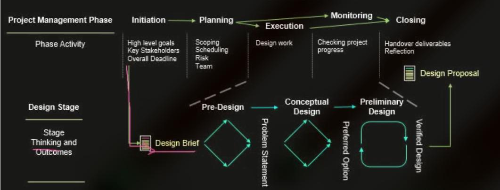
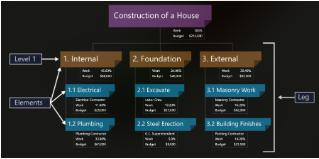
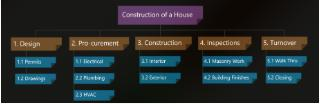
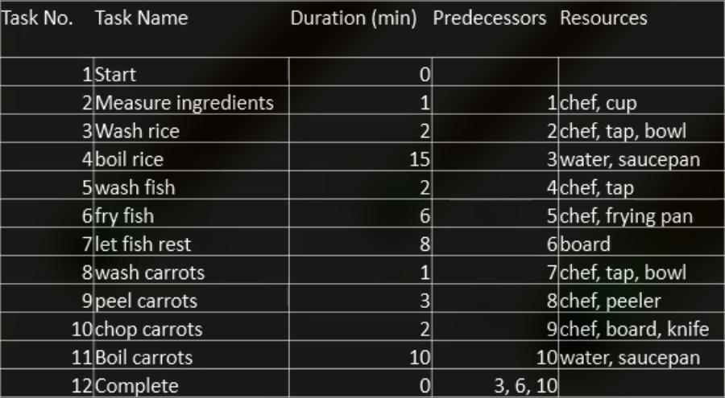
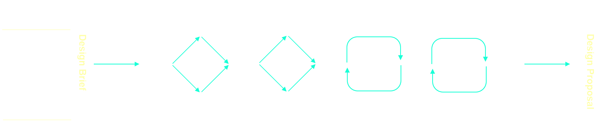

# Project Launch

## Engineering Project Management

### What needs to be managed and when?

* The ability to manage multiple aspects of a project is an important ability of an engineer.
* Understand the fundamental principles of engineering project management as a basis of planning.
* There are elements of project management that are the responsibilities of all members of the design team.

#### The What

Introduction to project management that you will be able to build on in later courses. Ten ares of a project that need to be managed:

* Integration
* Scope
* Schedule
* Costs
* Quality
* Human resources
* Communication
* Risk
* Procurement
* Stakeholders

#### The When

> <details>
>     <summary><b>DIAGRAM</b></summary>
>     
> </details>

* Project management Phase:

```
┌──────────┐           
│Initiation│           
└┬─────────┘           
┌▽────────────┐        
│Planning     │        
└┬───────────┬┘        
┌▽─────────┐┌▽────────┐
│Monitoring││Execution│
└┬─────────┘└┬────────┘
┌▽───────────▽┐        
│Closing      │        
└─────────────┘        
```

### Project Planning - Scoping

* Determine the work needs to be done and what doesn't need to be done.
* `scope creep` which is where the original scope of work keeps expanding slightly but you are not equipped with sufficient additional material.

1. __Project Objectives__ `-` Overall project statement, what you are trying to achieve
2. __Project Deliverables__ `-` These are the items are artefacts that you need to deliver to stakeholders
3. __Key Milestones__ `-` What are the deadlines that the deliverables need to be submitted by. You might like to consider the milestones for submitting yout assesment
4. __Requirements__ `-` These have been spoken before in oother topics, for us you want to think about the design requiremtnts
5. __Limites and Exclusions__ `-` Defind and Declade what the boundaries of the work arem what is in scope
6. __Reviews__ How the work will be reviewd and by who and when. How will feedback be incorprated into the design

#### The Work Breakdown Structure

* `A tool used to devide a project into manageble
segments to ensure that thte complete scope of the
work is understood`
* There are a few different formats and styles of Work Breakdown Structure `WBS`, including as a hierachical list ot a hierachical diagram. There are also selivaerable based, phase based `WBS`



* If you consider your design project then you have a set of clear deliverable, the Project Proposal, the Design Review and the Reverse Client Brief



### Project Planning - Scheduling

Once the tasks and activiteis are broken down (your `WBS`). Now work out what order should they be done. To do this we use a process called scheduling and specifically a `Grant chart`



#### Document Managment

* Engineering project creates a lot of documentation
    * The Right people need access to this documentation at the right time
    * Sometimes the should be private
* Larger project may also involved multiple project teams
* Document management uses Building Information Modelling `BIM`

> [!NOTE]
> When form a design team you will need to create a Common Data Environment `CDE` which is essentially a cloud-based shared space where all design team member can access the materials.

## Pre-Design

```
* Solve the Right Problem
* solve the Problem right
```



* Pre-Design Stage
    * Requirements
    * The design must meet (The Design Requirements)
    * The Problem Statement provides the description of the problem in a way that is understandable by the client and actionable by the designer

``` 
The pre-design stage is important because if the
desires are wrongly identified to the 
engineers/designer the solutions will always be wrong
```


