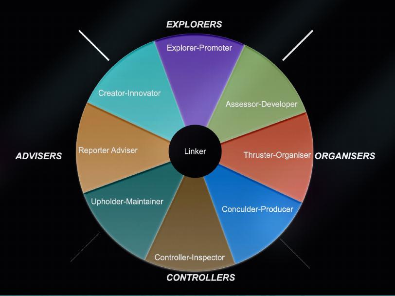
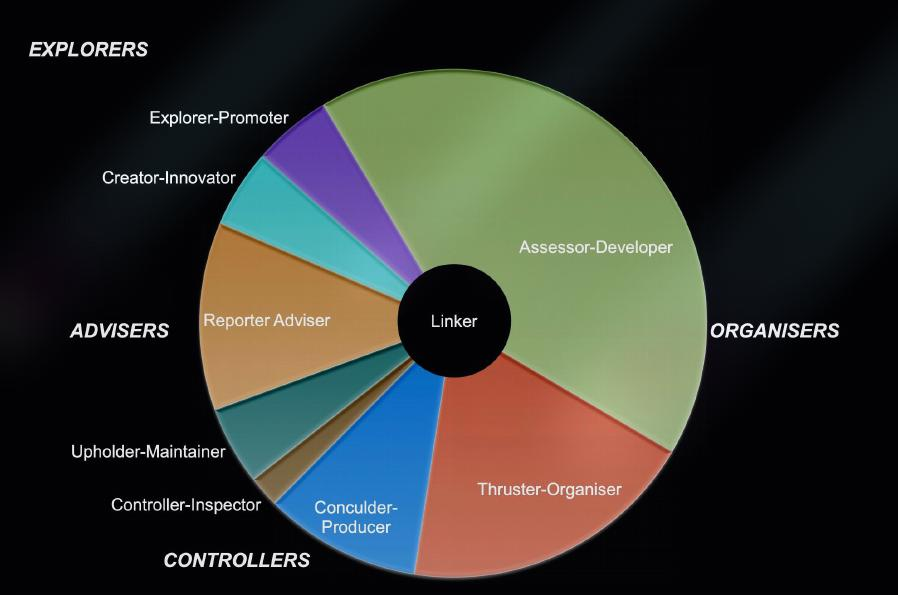
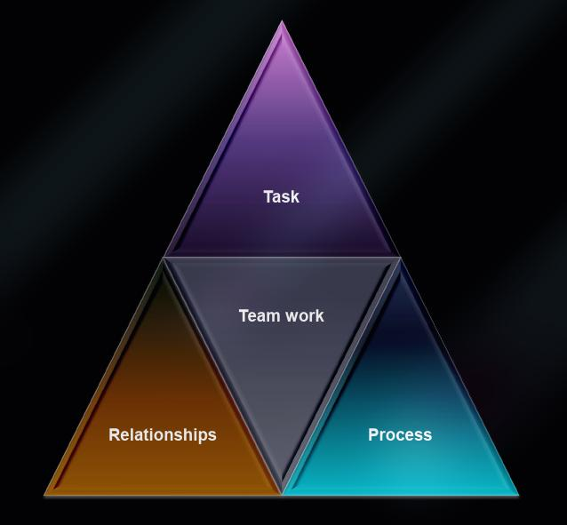
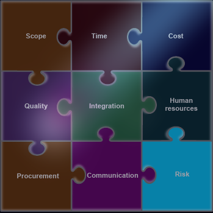

# Introduction

## Professional Engineering

* Definition of Professional Engineering. Demonstrate professional behaviour
    * Theory, Skills, Education
    * Authority, Autonomy
    * Community sanction (licensingm, certification)
    * Ethics
    * Culture, associations
    * Services orientation
* `=>` Professional engineering is a continuous process of growth that never stop and last a life long through out an engineer carrer
* `=>` Building those criteria above will enhance an engineer's professionalism and profession

## Working in Teams

### Purpose of Working in a Team

* Enssential professional skill
* Combining
    * Skills and knowledge
    * Creativity
    * Diversity
* Good for
    * Managing large and complex objects
    * Minimising missed opportunities
    * Making friends

### The Cycle of a Team

* __Forming__
    * Getting to know each other
    * Avoiding conflict: positive and polite, or quite and resreved
    * Establishing a team charter
* __Storming__
    * Allocation of team roles
    * Brainstorming on how to approach a problem
    * Conflict and Frustration, avoidance of tasks
* __Norming__
    * Understanding of individual roles
    * Resolution of differences, mutual respect
    * Often a focus on conflict avoidance
* __Performing__
    * Achiving without conflict
    * Team works independently

### Necassity to Work in a Team

* Commiment
* Communication
* Management
* Conflict resolution

### Roles

- [ ] A Leader
- [ ] Someone with ideas
- [ ] People who get things to happen at the various stages of the project
- [ ] Someone to evaluate an improve processes
- [ ] Someone to make sure final product is fit for purpose
- [ ] People who can lead negotiations and who attend to the needs of the individual members


```
┌──────────────────────┬───────────────────────────┐
│Role                  │ Description               │
├──────────────────────┼───────────────────────────┤
│Shaper                │ Task-oriented leadership  │
├──────────────────────┼───────────────────────────┤
│Plant                 │ Winning ideas             │
├──────────────────────┼───────────────────────────┤
│Monitor-Evaluator     │ Improving processes       │
├──────────────────────┼───────────────────────────┤
│Completer-Finisher    │ A quality product         │
├──────────────────────┼───────────────────────────┤
│Implementer           │ Making it happen          │
├──────────────────────┼───────────────────────────┤
│Resources investigator│ Resource investigator     │
├──────────────────────┼───────────────────────────┤
│Co-ordinator          │ People-oriented leadership│
├──────────────────────┼───────────────────────────┤
│Team worker           │ Keeps the team happy      │
├──────────────────────┼───────────────────────────┤
│Specialist            │ Content-experts           │
└──────────────────────┴───────────────────────────┘
```

#### Team Management

> <details>
>     
> </details>

#### Potential Issues

> <details>
>     
> </details>

### Leadership

* Ledership Structures/types
    * One individual
        * Transformational leadership - a visionary
        * Transactional leadership - instruct and obey
        * Mixed
    * Democratic decision making, with appointed facillitator
* `=>` For your projects, start with nominating an individual
* `=>` Each team member should be a Leader for at least ONE week !

### Team Challenges

* Free loading
* Other Commiments
* Interpersonal disagreements / conflicts
* Lack of focus
* Withdrawal
* Negative critism
* Control / domination
* Poor quality of work
* Poor communication
* Differences in expectations

### Dealing with Conflict

> <details>
>     
> </details>

* early intervention
    * Adress it when it occurs
* Solve as a team
* Difficult conversation
    * Face-to-face dicussion
    * Appoint a mediator
    * Prepare and avoid emotion
* Negatiate outcomes
* Plan to resolve
* Monitor
* Escalate (last resort)

### Team charter & Code of Conduct

* No set struture, but must be agreed upon
* Roles and responsibilities
* Acceptable team conduct
  * Attendance at meetings
  * Participation
* Meeting schedule
* Communication strategies
* Review processes
* Procedure to deal with lack of participation

## Engineering Projects

`"Failing to plan is planning to fail" - Alan Lakein`

### Project Managment

* **Project**: "Temporary endearvour undertake to create a unique product or service" (Project Managment 2028)
* **Managment**: "The appplication od knowledge, skill, tools and techniques to project activities to meet project requirements" (Project Managment Institute 2028)

> <details>
>     
> </details>


> [!NOTE]
> * **Objectives**: What the project trying to achive
> * **Deliverabilities**: Product or services, and acncillaries, including reports

## Project Managment life cycle

```
┌──────────┐
│Initiating│
└┬─────────┘
┌▽──────┐   
│Planing│   
└┬──────┘   
┌▽────────┐ 
│Executing│ 
└┬────────┘ 
┌▽─────────┐
│Monitoring│
└┬─────────┘
┌▽──────┐   
│Closing│   
└───────┘   
```

`source: Project Management Institute 2008. A guide to the project management body of knowledge (PMBOK Guide). 4th edn. Project Management Institute Inc., Newtown Square, PA`

### Project Charter

* Key personnel
  * Inc, project manager
* Objectives
* Scope
* Deliverables
* Constraints
* Stakeholders
* Ground rules / procedural matters
    * Communicate / meetings
    * Disciplinary procedures

### Project Scope

* Project scope : is the scope which projects cover and should be clearly defined
  * Inclusion and Exclusion
  * seek agreement with skateholers (e.g client, comminitym team members)

### Project Planning

- [ ] Define activities: Work Breakdown Structures
- [ ] Identify sub-tasks
- [ ] Sequence activites
- [ ] Estimate required sources
- [ ] Estimate duration
- [ ] Develop schedule; **Grantt chart**
