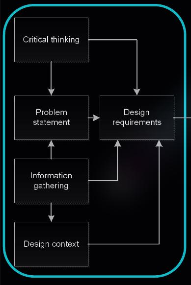

# Design Process

## The Basics


* Client needs/ideas
  * Demands from clients 
* Design idea
  * Deisign a solution to a problem
* Testing
* Design
  * Design com from degisn ideas
  * Workshops
* Prototype / model
  * Design a working prototype or model follows the design
  * scalable

## Alternative form


* Discover
  * Define the design challenges
* Empathise
  * Understand the context
  * Information gathering
* Ideate
  * Create solutions
  * Concept generations
* Prototype
  * Prototype test
  * User feedback
* Deliver
  * Development
  * Implimentation
* Continue
  * Maintanance

## Detailed Process


### Problem Statement and Design Context
> <details>
>     <summary><b>DIAGRAM</b> </summary>
>     
> </details>

#### Problem Statment

* Defines the problem
    * e.g Provide eletricity for 60 students
* Defines what is needed
* Guides the process
* Critical thinking
* information gathering
* Design context
    * Depends on the information gathered and generate probable solution

> __EWB CHALLENGE__
> * Problem to adress:
>     * Read document 2023 EWB Challenge Design Brief with Pu Ngaol village in Mondlkin province available on `canvas`
>     * Select your design topics by the end of **Week 3**
> * Design context and information gathering
>     * Ultilise the backgrounf information that EWB have gathered
>     * Available on `EWB website` and `canvas`

#### Design requirements

* Clear set of project requirements
* Functions, objectives and constrains
* Establish criteria (for evaluation and testing)
    * e.g Goverment regulation, physical

> __EWB CHALLENGE__
> * Project requirements
>     * Functions
>     * Constraints
>     * Objectives
> 
> * Functions
>     * Whats the design __must do__
> * Constraints
>     * What the desgin __must have__
>     * Legal requirements, safety requirements etc.
>     * Whithout these, the design is not eliigible for consideration
> * Objectives
>     * What the design __should be__
>     * Typically the basis for criteria & used for design selection
>
> ##### Desgin Objectives
> 
> * Developments of Objective and constraints
>     * Use the `Design Considerations`
### Idea Generation

> <details>
>     <summary><b>DIAGRAM</b> </summary>
>     
> </details>


* Ideations (aka. brainstorm)
* Functional analysis
    * Function of solutions
* Morphological charts (more details on **WEEK 4**)

> __EWB CHALLENGE__
> * Moderator
>     * Someone who overseas the process
>     * Encourages new ideas
>     * Doesn't shut-down crazy ideas
> * refer to your project requirements
> * Any overlap of ideas `=>` combine?
> * Sketches, Photos, stick-it-notes
> * Invites someone who doesn't know anything abt the project
> * Document the methods and outcomes
>     * Needed for your report `!!`

### Evaluation and Selection

> <details>
>     <summary><b>DIAGRAM</b> </summary>
>     
> </details>

* `optional` Testing
    * Project managment
    * Criteria

### Detailed Design and Prototyping

> <details>
>     <summary><b>DIAGRAM</b> </summary>
>     
> </details>

#### Detailed design

* `optinal` Iteration between testing and design
    * Potentially going back to the start `!!`

#### Prototyping

* In real life and industrial context, physical prototype is a *must*
* Prototype must meet requirements, quality ot even standards

### Finalised

> <details>
>     <summary><b>DIAGRAM</b> </summary>
>     
> </details>

* Fully documented design
    * Dimension, material , method of productions etc.
    * Maintanance, training
* Implimentation schedule
* For manufatture, constructions

### Additional Factors

#### Communication

* Quotes and Invoice
* Photos, Presentation, Sketches and Drawing
* Emails, Test Results, Meetings
* Project Schedule, Calculation and Spreadsheets

### EWB Challenge

#### First stage of EWB Challenge

* Executive summary
* Introduction, including the indentification of information and selection of design area/project
* Preliminary design requirements
* Preliminary design solution(s)
* Reflection on team work to date
* Plan for delivery of the report at the end of semester, icluding `Work Breakdown Structure (WBS)` and `Grantt Chart`

#### Expectations and Tips

> [!TIP]
> * Meet outside of your tutorial / workshop time
> * Keep good written records, especially meetings, emails etc
> * Try to solve team issues yourselves
> * Don't worry about unknowns
>     * Help each other and seek help
> * Play to each others strengths
> * Be organized
>     * Develop a project schedule & review this regularl
>     * Use [`doodle.com`](https://doodle.com) or other tool to find a time that suits

#### Guidance & Reference from EWB

> [!NOTE]
> * Available via `canvas`
> * Group still need to develop their own project plans

## Standards

```
* A means to evaluating acceptability for use
    * To ensure products, services and system safety, reliablility and consistency perform the way they were intended to
* International Organization (ISO):
    * e.g ISO 9001:2015 Quality Managment Systems - Requirements
* American Society for Mechanical Engineers (ASME) Standards:
    * e.g Boiler and Pressure Vessel Code
* Australian Design Rules
    * e.g ADR 79/02 - Emission control for flight vehicles
* British Publically Available Specification (PAS)
    * e.g PAS 754:2014 - Software trustworthies
```

### Testing Standards

* Methods
    * Depnds on the standards:
        * In-house
        * Done on testing body:
            * e.g `ALS industrial`, `Bureu Veritas` tc.
            * Testing body oftern certified to carry out certain tests by the `National Association of Testing Authorities`

### Integration into Design Standards

* Design constraints
    * __Must__ comply to standards (_hard_ standard)
    * __Should__  comply to standards (_soft_ standard)

* Multiple Standards can affest one product
    * e.g `ASME` and `AS` standards compliance
    * Often duplicate requirements `=>` which on to take
        * Typically the most conservative
    * Companies oftern writes their own standrdsm and have key suppliers & customers agree to their implementation

### Compulsory of Standards

* _Some_ standards are mandated by law, others are not
* Uder civil law, failing to adhere to a standard could be viewed as ignoring best pratice
    * i.e Fail to carry out a duty of care that reasonable person would expect

```
 Quality = 
 
 Ability og people to use your documentation (reports, drawing, presentation etc) to implement the recommendations that you are making
 
 Include: accurate, clear, logical, consistently following normal conversation such as referencing style,NO plagiarism ...
```

## Additional Resources

* Read the EWB Challenge design brief
    * `canvas` `=>` 2023 EWB Challenge Design Brief with Pu Ngaol village in Mondulkiri province

* Deisgn Process:
    * Prescribed textbook
    * McCahan et al., Part 2. pp. 34-217 


