# Risk Management

## Introduction

* Risk is all around us
* You can _NEVER_ eliminate
* `Risk management` techniques can be used to
  * Identify
  * Assess
  * Manage

## Types of Risk

```
┌──────────────┬───────────────────────────────────────────┬──────┐
│Company risk  │ Business operations                       │      │
├──────────────┼───────────────────────────────────────────┼──────┤
│Project risk  │ Planning and delivery of a project        │      │
├──────────────┼───────────────────────────────────────────┼──────┤
│Process risk  │ Planning and delivery of a product/service│      │
├──────────────┼───────────────────────────────────────────┼──────┤
│Financial risk│ loss of income / wealth                   │      │
├──────────────┼───────────────────────────────────────────┼──────┤
│Safety riskes │ injuries; Death                                  │
└──────────────┴───────────────────────────────────────────┴──────┘
```

## Risk Management Process

<details>
  <summary>Risk Management Process</summary>
  <p align="center">
    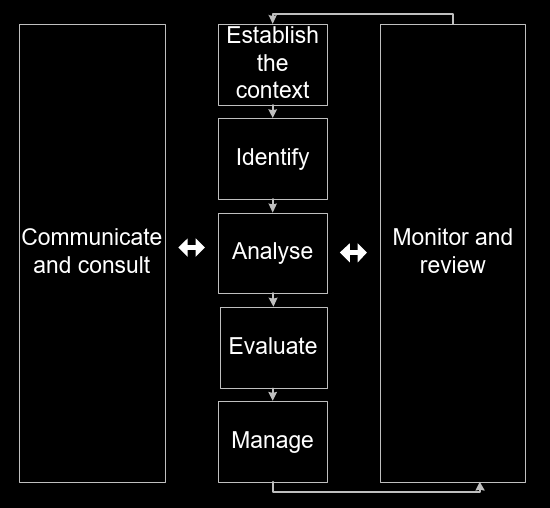
  </p>
</details>

### Establish The Context

<p align="center">
  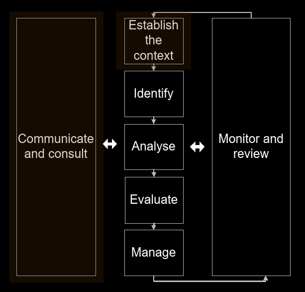
</p>

* Social, political, legal etc
* History and trends
* Relationships
* Company processes
* Define
  * Roles and responsibilities 
  * Methods and processes
  * Risk criteria

### Undertake a Risk Assessment

<p align="center">
  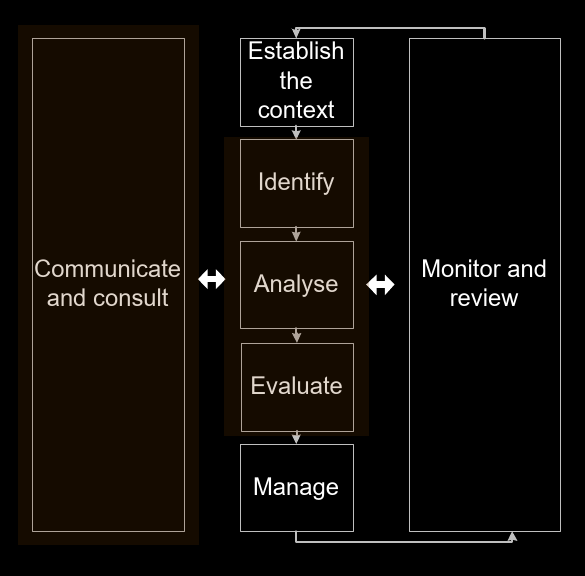
</p>

* `Risk assessment` is a critical part of a `risk management`
* Involves:
  * Identifying the risk
  * Analysing the risk
  * Evaluating the risk

<p align="center">
  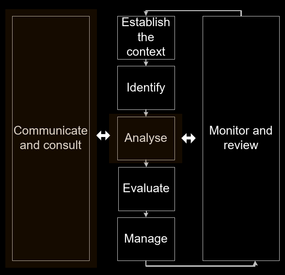
</p>

* Identify:
  * Sources of risk
  * Causes of risk
  * Potential consequence
  * External and internal

<p align="center">
  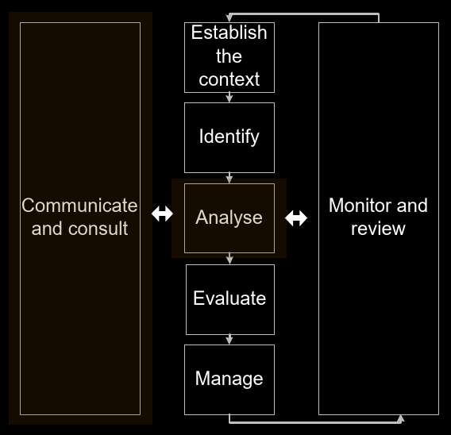
</p>

* Analyse:
  * Using quantified levels of `Likelihood` and `consequence`   

#### Forecasting Approach to Likelihood

```
┌─────┬───────────────┬────────────────────────────────────────────┐
│Level│ Likelihood    │ Example Descriptions                       │
├─────┼───────────────┼────────────────────────────────────────────┤
│1    │ Rare          │ May occur only in exceptional circumstances│
├─────┼───────────────┼────────────────────────────────────────────┤
│2    │ Unlikely      │ Could occur at some time                   │
├─────┼───────────────┼────────────────────────────────────────────┤
│3    │ Possible      │ Might occur at some time                   │
├─────┼───────────────┼────────────────────────────────────────────┤
│4    │ Likely        │ Will probably occur in most circumstances  │
├─────┼───────────────┼────────────────────────────────────────────┤
│5    │ Almost certain│ Is expected to occur in most circumstances │
└─────┴───────────────┴────────────────────────────────────────────┘

```

#### Reflective Approach to Likelihood
```
┌─────┬───────────────┬──────────────────────────────────────────────────────┐
│Level│ Likelihood    │ Example Descriptions                                 │
├─────┼───────────────┼──────────────────────────────────────────────────────┤
│1    │ Rare          │ Has never occured                                    │
├─────┼───────────────┼──────────────────────────────────────────────────────┤
│2    │ Unlikely      │ Has occurred but only under exceptional circumstances│
├─────┼───────────────┼──────────────────────────────────────────────────────┤
│4    │ Possible      │ Sometimes occurs                                     │
├─────┼───────────────┼──────────────────────────────────────────────────────┤
│5    │ Almost certain│ Always occurs                                        │
└─────┴───────────────┴──────────────────────────────────────────────────────┘

```
#### Consequences

```
┌─────┬──────────────┬──────────────────────────────────────────────────────────────────────────────────────────────────────────────────────┬───────────────────────────────────────────────────────────────────────────────────────────────────────────────────────┐
│Level│ Consequnces  │ Example Descriptions                                                                                                 │                                                                                                                       │
├─────┼──────────────┼──────────────────────────────────────────────────────────────────────────────────────────────────────────────────────┼───────────────────────────────────────────────────────────────────────────────────────────────────────────────────────┤
│1    │ Insignificant│ No injuries; low financial loss; no inconvenience                                                                    │                                                                                                                       │
├─────┼──────────────┼──────────────────────────────────────────────────────────────────────────────────────────────────────────────────────┼───────────────────────────────────────────────────────────────────────────────────────────────────────────────────────┤
│2    │ Minor        │ First asid treatment; on-site release immediately contained; medium financial loss; minor inconvenience              │                                                                                                                       │
├─────┼──────────────┼──────────────────────────────────────────────────────────────────────────────────────────────────────────────────────┼───────────────────────────────────────────────────────────────────────────────────────────────────────────────────────┤
│3    │ Moderate     │ Medical treatment required; on-site release contained with outside assitance; high financial loss. Some inconvenience│                                                                                                                       │
├─────┼──────────────┼──────────────────────────────────────────────────────────────────────────────────────────────────────────────────────┼───────────────────────────────────────────────────────────────────────────────────────────────────────────────────────┤
│4    │ Major        │ Extensive injuries                                                                                                   │ loss of production capability; off-site release with no detrimental effects; major financial loss. Major inconvenience│
├─────┼──────────────┼──────────────────────────────────────────────────────────────────────────────────────────────────────────────────────┼───────────────────────────────────────────────────────────────────────────────────────────────────────────────────────┤
│5    │ Catastrophic │ Death; toxic release off=site with detrimental effect; huge financial loss. Completion of task not possible          │                                                                                                                       │
└─────┴──────────────┴──────────────────────────────────────────────────────────────────────────────────────────────────────────────────────┴───────────────────────────────────────────────────────────────────────────────────────────────────────────────────────┘

```
### Evaluation

<p align="center">
  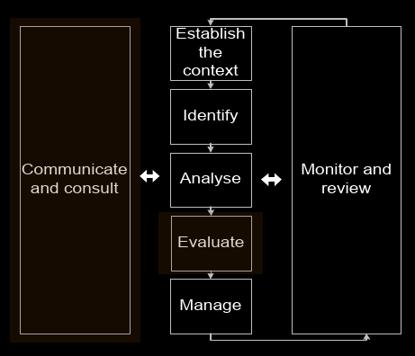
</p>

`LEVEL OF RISK = LIKELIHOOD X CONSEQUENCE`

```
┌──────────────────┬──────────────────┬──────────┬─────────────┬──────────┬─────────────────┐
│Likelihood        │ Consquence       │          │             │          │                 │
├──────────────────┼──────────────────┼──────────┼─────────────┼──────────┼─────────────────┤
│LIkelihood        │ Insignificant (1)│ Minor (2)│ Moderate (3)│ Major (4)│ Catastrophic (5)│
├──────────────────┼──────────────────┼──────────┼─────────────┼──────────┼─────────────────┤
│5 (almost certain)│ 5                │ 10       │ 15          │ 20       │ 25              │
├──────────────────┼──────────────────┼──────────┼─────────────┼──────────┼─────────────────┤
│4 (likely)        │ 4                │ 8        │ 12          │ 16       │ 20              │
├──────────────────┼──────────────────┼──────────┼─────────────┼──────────┼─────────────────┤
│3 (moderate)      │ 3                │ 6        │ 9           │ 12       │ 15              │
├──────────────────┼──────────────────┼──────────┼─────────────┼──────────┼─────────────────┤
│2 (unlikely)      │ 2                │ 4        │ 6           │ 8        │ 10              │
├──────────────────┼──────────────────┼──────────┼─────────────┼──────────┼─────────────────┤
│1 (rare)          │ 1                │ 2        │ 3           │ 4        │ 5               │
└──────────────────┴──────────────────┴──────────┴─────────────┴──────────┴─────────────────┘
```

*   \> 12 __E__: Extreme; immediate action required
* 8 - 12 __H__: High risk; senior management attention required
* 4 - 6  __M__: Moderate risk; management responsibility required
* 1 - 3  __L__: Low risk; managed by routine operations

<details>
  <p align="center">
    <summary><b>EXAMPLE</b></summary>
     Normal
    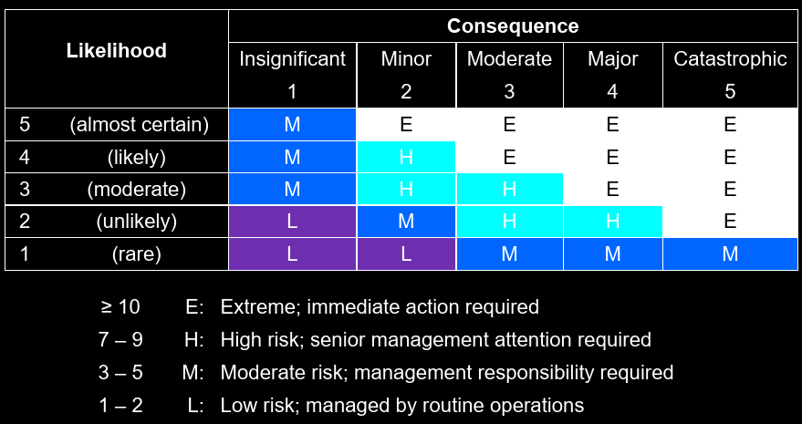 More conservative
    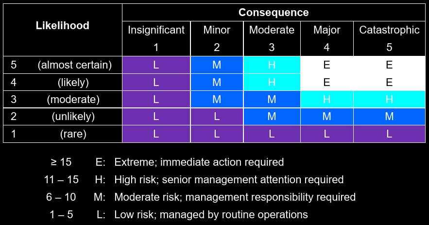 More aggressive
  </p>
</details>

### Managing Risk

* Manage
  * Modify and implement
* Principles
  * Communicate and consult
  * Eliminate
    * Evaluate `option A` vs `option B` 
  * Reduce likelihood
    * Training & education
    * Preventative maintenance
    * Auditing programs
    * Quality assurance, inspection and testing
    * Process change
  * Reduce Consequence
    * Personal protective equipment (PPE)
    * Barriers
    * Recovery plans
  * Share risk
  * Take on risk

<p align="center">
  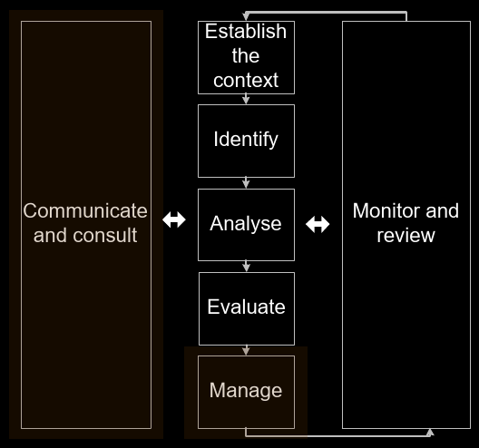
</p>

### Monitor and Review

* Document the process
* Review strategies for `risk management`
* Check that ll risks have been identified

<p align="center">
  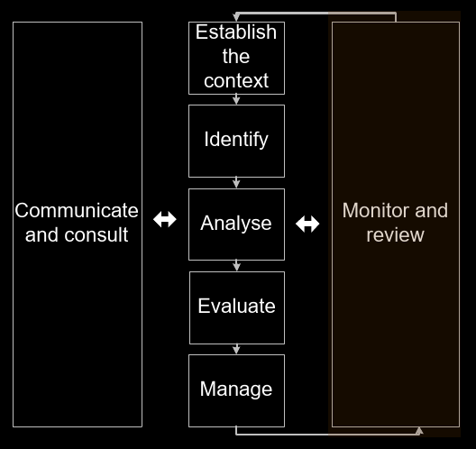
</p>

### Tender response example

* Risk and Insurance

<p align="center">
  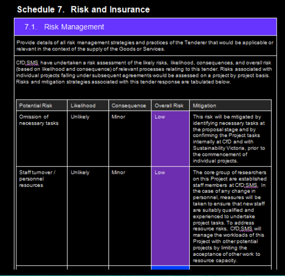
</p>

## EWB Project section

* Final report
  * Risk Management plan for _implementation_ of project
  * Using quantified `risk management`
    * What are the risks that might be encountered?
    * What is the `likelihood` that these would happen?
    * What is the `consequence` if these were to happen
    * Quantify the `likelihood`, `consequence` and `risk scores`
    * What will you have in place to reduce risk (mitigation strategies)
    * A table is often the best way to address this

<p align="center">
  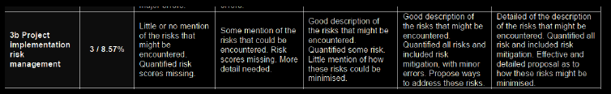
</p>

## Additional resources

* McChahan , S, Anderson, P, Korstchot, M, Weiss, P, & Woodhouse, K, 2015, Designing Engineers, John Wiley & Sons, Hokoben, New Jersey
  * Risk management: pp. 477 - 478 & 550 - 562
* Internal Standard for Risk Management
  * AS/NZS ISO 31000:2009
  * [saglobal](https://www.saiglobal.com/online/autologin.asp)
