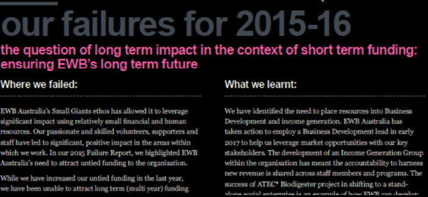
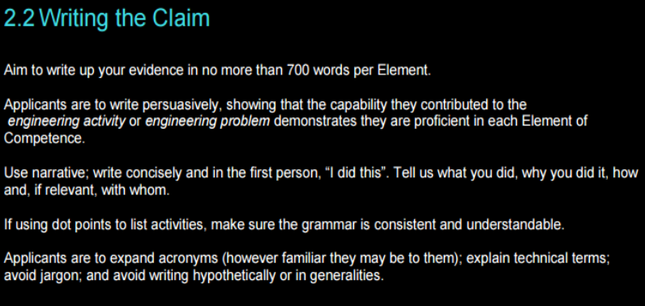
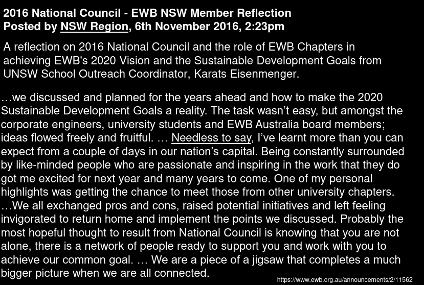
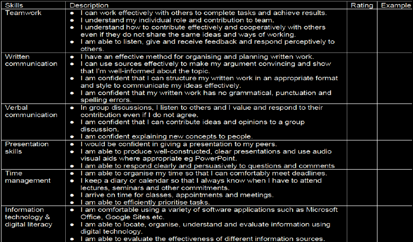

# Lecture 9 - Self Reflection Writing

## Purpose of Self-reflection in Engineering

* Effective professionals _review_ what they do and think about how they can _improve performance_

* Identify:
  * What you have accomplished 
  * Why it matters
  * Where you are at (in terms of self / professional development)

* Reflect on:
  * How you form relationships & work with others
  * How you are managing your study load

* Do it better next time

* Understand who you are
  * Strengths
  * Weaknesses
  * Achievements
  * Skills

* Grow as a `mentor` and `leader`
  * Provide advice to others who face a similar situation

* Prepare for getting a job

## When to Reflect

* At the end of a `project` (as a group)

* Applying for a job
  * Writing a cover letter
  * Preparing for an interview

* After you fail at something
  * How you can do it better next time

* Before you graduate
  * Writing reflection reports

* After you graduate
  * Writing a reflection report is mandatory for gaining Level 2 accreditation (Chartered Engineering)

## Failure Acknowledgment

  

## Reflective Writing in Professional Development

  

  
<b>Reflective Writing Example</b>

  

    
  

### Personal-reflection Assessment Task

* List the top three `skills` you identified in [Week 2](./w2-project.md) as an `area` of improvement of your professional skills

* By reflecting on the plan developed during [Week 2](./w2-project.md), _how have you progressed in developing these three professional skills?_
  * Provide _specific activities_ that you have completed which are directly related to these skill development
  * Making reference to your study, and/or extracurricular activities

* If you have made no progress in the skill development, what have been the barriers/challenges stopping you from developing these skills

* Identify _two different skills that you would like to further develop and identify a plant of how you can develop these in the future_
  * The plan should include activities you intend to undertake, timing and resources needed

### Team Reflection

* Discuss how your EWB project has progressed throughout the semester
* Provide examples of research you and your group have conducted over the semester
* What `problems` or challenges did your group face? How were these resolved?
* Was there anything you would have done differently as an individual or as a team?

  
<b>Personal-reflection Template</b>

  

    
  

> [!NOTE]
> Each team member has to write 3 sentences as individual reflection in the [Design Project Report](https://rmit.instructure.com/courses/135772/assignments/925223)

